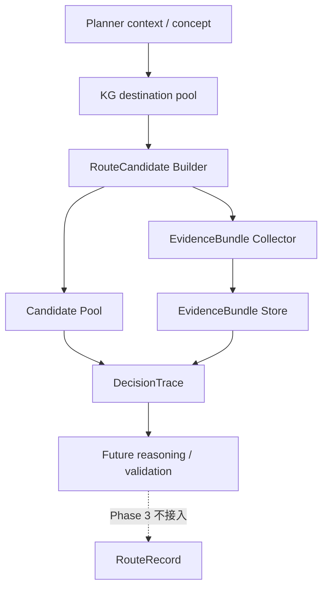

# Route Generation V2 Phase 3 Proposal: EvidenceBundle

## 1. EvidenceBundle 是什么

EvidenceBundle 是绑定到 `RouteCandidate` 的独立证据包，用来回答：

> 这条候选路线有哪些真实证据支持，哪些只是弱信号，哪些仍然未知，哪些证据获取失败。

它不是路线文案，也不是 Planner Reason。它解决的是 Phase 1 到 Phase 2B-2 之后仍然存在的问题：

- Candidate Pool 已经可以生成多个候选，但每个候选为什么成立还没有独立证据。
- 当前 `supportingSignals` 只能说明候选如何构造，不能等同于事实证据。
- 以后要比较候选、做验证、做 Review，需要知道证据来源，而不是只看最终 RouteRecord。
- 不能再用标题、简介、plannerReason 反向解释路线为什么成立。

Phase 3 的目标是先保存证据，不选择最佳候选，不评分，不改变旧系统最终返回的 RouteRecord。

## 2. 每条候选最少需要哪些证据

Phase 3B 本地证据阶段，每条 `RouteCandidate` 至少应尝试记录以下证据：

| 证据类型 | 最低要求 | 证据等级 |
| --- | --- | --- |
| 候选身份 | `candidateId`、`intentId`、`generationSource` | verified |
| 目的地身份 | 每个 destination 的 id / name / countryCode 来自 KG pool | verified 或 unknown |
| 国家匹配 | destination.countryCode 是否包含在 candidate.countries 中 | verified |
| 顺序完整性 | `proposedOrder` 中的目的地是否都能在 destinations 中找到 | verified |
| 坐标 | destination 是否有可用 latitude / longitude | verified 或 unknown |
| 段间距离 | 相邻目的地坐标可用时计算 haversine distance | verified-local |
| 时长适配 | durationDays 与目的地数量、travelStyle 是否大致匹配 | weak_signal |
| 交通真实可达 | Phase 3B 先标记 Unknown，Phase 3C 后再补证据 | unknown |
| 季节适配 | Phase 3B 如无本地 season/month 输入，标记 Unknown | unknown |
| 预算依据 | Phase 3B 标记 Unknown，Budget 策略未来单独实现 | unknown |

重要边界：

- `supportingSignals` 可以进入 EvidenceBundle，但只能作为 `weak_signal`，不能直接变成 verified evidence。
- `plannerReason`、route title、summary 不能作为证据来源。
- 数据不足时必须写 Unknown，不得补写看似合理但无法证明的事实。

## 3. 当前项目可直接使用的本地证据

当前已经具备以下本地证据来源：

| 来源 | 当前位置 | 可用内容 | Phase 3 用法 |
| --- | --- | --- | --- |
| RouteCandidate | `src/lib/routes/route-candidate-pool.mjs` | countries、destinations、proposedOrder、durationDays、travelStyle、generationSource、supportingSignals | EvidenceBundle 的候选输入 |
| Candidate Builder | `src/lib/routes/route-candidate-builder.mjs` | KG pool 构造方法、候选差异方法、稳定 candidateId、shape key | 记录候选构造弱信号 |
| KG destination pool | Planner 中 `selectDestinationPool()` 输出 | destination id、name、countryCode、entityType、坐标等 | 目的地身份、国家、坐标证据 |
| 本地距离计算 | Candidate Builder 已有距离相关逻辑 | pairwise distance、route distance summary | 本地 distance evidence |
| Existing evidence repository | `src/lib/routes/evidence-repository.mjs` | 已有 evidence 存储和 verified 语义 | 可借鉴字段和校验，但 Phase 3 不应直接从最终 RouteRecord 生成候选证据 |
| Web evidence provider | `web-search-evidence-provider.mjs` 等 | Tavily / web search 证据能力 | Phase 3C 以后接入，Phase 3A/3B 不调用 |

Phase 3 不能把 accepted repository 中的最终路线内容当作候选证据，因为这会把“已经生成出来的 RouteRecord”反向伪装成候选成立原因。

## 4. KG、坐标、距离、国家匹配、时长适配如何记录

### KG 证据

记录每个 destination 是否来自 KG pool：

- `sourceType: "knowledge-graph"`
- `sourceId: destination.id`
- `evidenceCategory: "destination-identity"`
- `extractedFacts`: name、countryCode、entityType、wikidataId 如存在
- `supportsWhichDecision`: `destination-inclusion`
- `status`: 字段完整则 `verified`，字段缺失则 `unknown`

### 坐标证据

对每个 destination 记录坐标可用性：

- `evidenceCategory: "coordinate"`
- `extractedFacts`: latitude、longitude
- `supportsWhichDecision`: `distance-calculation`、`route-order-feasibility`
- 坐标存在且为有限数字：`verified`
- 坐标缺失或非法：写入 `unknowns`

### 距离证据

对 `proposedOrder` 中相邻目的地计算距离：

- `sourceType: "local-computation"`
- `matchMethod: "haversine-local"`
- `evidenceCategory: "segment-distance"`
- `extractedFacts`: from、to、distanceKm
- `supportsWhichDecision`: `route-order-feasibility`
- 两端坐标都 verified 时：`verified`
- 任一端坐标缺失时：`unknown`

### 国家匹配证据

检查 candidate 的 destinations 是否属于 candidate.countries：

- `evidenceCategory: "country-match"`
- `extractedFacts`: candidateCountries、destinationCountryCode、matched
- `supportsWhichDecision`: `country-composition`
- 命中：`verified`
- 不命中：`failed` 或 `contradiction`

### 时长适配证据

Phase 3B 只做本地启发式记录，不做最终判断：

- `evidenceCategory: "duration-fit"`
- `sourceType: "local-heuristic"`
- `extractedFacts`: durationDays、destinationCount、travelStyle、estimatedPace
- `supportsWhichDecision`: `duration-feasibility`
- 默认只能是 `weak_signal`

只有未来接入真实交通时间、停留天数规则或人工验证后，才可以升级为 verified。

## 5. Tavily / Wikivoyage 等在线证据如何接入

Phase 3A 和 Phase 3B 不应调用 Tavily、Wikivoyage 或其它外部服务。

原因：

- 当前目标是建立 EvidenceBundle 结构和本地证据链。
- 外部服务会带来耗时、成本、失败、密钥和不可复现问题。
- 过早接入在线证据会模糊“本地可证明”和“联网补充”的边界。

Phase 3C 才建议接入在线证据，并且默认关闭：

- `ROUTE_V2_EVIDENCE_ONLINE_ENABLED=false`
- `ROUTE_V2_TAVILY_EVIDENCE_ENABLED=false`
- `ROUTE_V2_WIKIVOYAGE_EVIDENCE_ENABLED=false`

未来接入方式：

1. Candidate 先生成。
2. 本地 EvidenceBundle 找出缺口，例如 transport、season、budget、landmark facts。
3. Evidence adapter 根据缺口构造查询。
4. Tavily / Wikivoyage 只返回结构化 facts。
5. facts 写入 EvidenceBundle。
6. 不直接修改 Candidate，不直接生成 RouteRecord，不直接进入 Feed。

Tavily 失败时：

- 记录 `status: "failed"`
- 写入 `failureReason: "provider-not-configured" | "timeout" | "no-result" | "parse-failed"`
- Candidate 保持 pending 或 pending-evidence
- 旧 Planner 和 RouteRecord 不受影响

不能把“联网成功”等同于“路线推理成功”。

## 6. 证据状态分类

EvidenceBundle 需要明确区分四类状态：

| 状态 | 含义 | 示例 |
| --- | --- | --- |
| `verified` | 有明确来源和结构化事实支持 | KG 目的地 countryCode；坐标；本地距离计算 |
| `weak_signal` | 对判断有帮助，但不足以证明 | builder method；duration heuristic；entityType hint |
| `unknown` | 目前没有证据，不能判断 | 是否有直达火车；预算是否低；季节是否最佳 |
| `failed` | 尝试获取证据但失败 | Tavily timeout；provider 未配置；source parse failed |

建议每个 EvidenceBundle 同时保存：

- `items[]`: 已得到的证据或弱信号
- `unknowns[]`: 尚未证明的点
- `failures[]`: 尝试获取但失败的点
- `summary`: verified / weak / unknown / failed 数量

## 7. 如何防止从最终 RouteRecord 反向伪造证据

Phase 3 必须写死以下规则：

1. Evidence collector 的输入只能是：
   - RouteCandidate
   - Candidate Builder 使用过的 KG pool snapshot
   - 明确传入的本地计算结果
   - Phase 3C 后明确传入的外部 evidence result

2. Evidence collector 不得读取：
   - 最终 RouteRecord
   - route title
   - route summary
   - plannerReason
   - recommendationText
   - coverUrl
   - contentQualityStatus

3. 接入点必须位于候选生成之后、最终 RouteRecord 构造之前。

4. Schema 应拒绝明显来自最终展示层的字段，例如：
   - `title`
   - `summary`
   - `plannerReason`
   - `coverUrl`
   - `acceptedAt`
   - `contentQualityStatus`

5. 测试中应加入 poison data：
   - 构造一个带明显假标题 / 假 summary 的 RouteRecord。
   - 证明 EvidenceBundle 没有读取、保存或引用这些字段。

这样才能保证 EvidenceBundle 是候选前置证据，而不是路线生成后的解释包装。

## 8. EvidenceBundle 与 Candidate Pool、DecisionTrace 的关系

建议关系如下：

关联规则：

- `EvidenceBundle.candidateId` 必须指向 `RouteCandidate.candidateId`
- `EvidenceBundle.intentId` 必须与候选一致
- `EvidenceBundle` 不需要 routeId，因为 Phase 3 时候选还不应该变成最终路线
- DecisionTrace 后续可以记录：
  - candidateIds
  - evidenceBundleIds
  - dataSourcesUsed
  - unknowns
- Phase 3 不让 EvidenceBundle 影响 Review、Ready Pool 或 Feed

## 9. Feature Flag 设计

建议保留分层开关，默认全部关闭：

| Flag | 默认值 | 作用 |
| --- | --- | --- |
| `ROUTE_V2_EVIDENCE_BUNDLE_ENABLED` | `false` | EvidenceBundle 总开关 |
| `ROUTE_V2_EVIDENCE_LOCAL_ENABLED` | `false` | 是否收集 KG / 坐标 / 距离 / 国家匹配等本地证据 |
| `ROUTE_V2_EVIDENCE_ONLINE_ENABLED` | `false` | 是否允许在线证据 |
| `ROUTE_V2_TAVILY_EVIDENCE_ENABLED` | `false` | 是否允许 Tavily |
| `ROUTE_V2_WIKIVOYAGE_EVIDENCE_ENABLED` | `false` | 是否允许 Wikivoyage |
| `ROUTE_V2_EVIDENCE_REQUIRED_FOR_ACCEPT` | `false` | 预留，Phase 3 不启用 |

Phase 3A 可以只实现 schema/store，不接入 Planner。

Phase 3B 如果接入 Planner sidecar，必须同时要求：

- Candidate Pool 已开启
- EvidenceBundle 已开启
- Local evidence 已开启

任一 flag 关闭时，不写 EvidenceBundle，不改变旧系统。

## 10. 如何保证开启 / 关闭都不改变 RouteRecord

必须遵守：

- EvidenceBundle 不传入 `buildRouteSkeleton()`
- EvidenceBundle 不传入 `buildPlannerRecord()`
- EvidenceBundle 不参与 legacy validation
- EvidenceBundle 不参与 dedupe
- EvidenceBundle 不改变 accepted / rejected 判断
- EvidenceBundle 不改变 Feed、Search、Detail、图片系统

失败降级规则：

- EvidenceBundle 生成失败：记录 diagnostics，旧 Planner 继续。
- EvidenceBundle 写入失败：不阻断 RouteRecord。
- 在线证据超时：写 failed evidence 或 unknown，旧 Planner 继续。
- Candidate 无法收集证据：candidate 可保持 pending-evidence，但 legacy RouteRecord 不受影响。

验收必须深度比较：

- flag off RouteRecord
- flag on RouteRecord

两者必须完全一致。

## 11. 是否建议拆成 Phase 3A / 3B / 3C

建议拆分，而且不要一次做完。

### Phase 3A：EvidenceBundle schema + store

目标：

- 新增 EvidenceBundle schema
- 新增 EvidenceBundle JSONL store
- 验证合法 / 非法证据包
- 不接入 Planner
- 不读取 Candidate Pool
- 不调用外部服务

预计新增：

- `src/lib/routes/evidence-bundle-schema.mjs`
- `src/lib/routes/evidence-bundle-store.mjs`
- `scripts/verify-route-v2-phase3a-evidence-bundle.mjs`
- `ROUTE_V2_PHASE_3A_IMPLEMENTATION_REPORT.md`

验收重点：

- JSONL 每行可解析
- invalid bundle 被拒绝
- stable evidenceId 不变
- store 与 accepted repository、candidate pool 分离
- flag 关闭不写入

### Phase 3B：本地证据收集

目标：

- 从 RouteCandidate + KG pool snapshot 收集本地证据
- 记录 KG、坐标、距离、国家匹配、时长弱信号
- 不调用 Tavily / Wikivoyage
- 不评分，不选择最佳候选

预计新增或修改：

- `src/lib/routes/evidence-bundle-local-collector.mjs`
- `src/lib/routes/route-composition-planner.mjs` 最小 sidecar 接入
- `scripts/verify-route-v2-phase3b-local-evidence.mjs`
- `ROUTE_V2_PHASE_3B_IMPLEMENTATION_REPORT.md`

验收重点：

- EvidenceBundle 在 RouteRecord 前生成
- 不能读取 title / summary / plannerReason
- flag 开关前后 RouteRecord 深度一致
- accepted-routes 和 bootstrap hash 不变

### Phase 3C：在线证据接入

目标：

- 使用现有 web evidence provider / extractor / corroborator
- Tavily / Wikivoyage 只补事实，不直接决定路线
- 默认关闭
- 测试优先使用 injected provider，不依赖真实网络

预计新增：

- `src/lib/routes/evidence-bundle-online-adapter.mjs`
- `scripts/verify-route-v2-phase3c-online-evidence.mjs`
- `ROUTE_V2_PHASE_3C_IMPLEMENTATION_REPORT.md`

验收重点：

- provider 未配置时安全降级
- timeout 记录 failed，不阻断旧 Planner
- 不改变 RouteRecord
- 不污染真实 cache

## 12. 测试、风险和预计修改文件

### 测试与验收标准

Phase 3 总体验收应覆盖：

1. 合法 EvidenceBundle 可保存和读取。
2. 非法 EvidenceBundle 被 schema 拒绝。
3. evidenceId 稳定。
4. JSONL 每行可独立解析。
5. store 与 accepted repository / candidate pool 分离。
6. flag 关闭时不写 evidence。
7. flag 开启时只旁路写 evidence。
8. RouteRecord 开关前后完全一致。
9. accepted-routes.json hash 不变。
10. route-feed-bootstrap.js hash 不变。
11. FeedReadyPoolCount 不变。
12. Feed、Search、Detail 不读取 EvidenceBundle。
13. 真实 `.route-v2-cache` 不被测试污染。
14. 不调用外部服务完成默认测试。
15. poison RouteRecord title / summary / plannerReason 不进入 EvidenceBundle。
16. Unknown 和 failed 被明确记录，不被伪装成 verified。

需要继续运行现有回归：

- `node scripts/verify-route-v2-tooling-cleanup.mjs`
- `node scripts/verify-route-v2-phase2b2-planner-sidecar.mjs`
- `node scripts/verify-route-v2-phase2b1-candidate-builder.mjs`
- `node scripts/verify-route-v2-phase2a-candidate-pool.mjs`
- `node scripts/verify-route-v2-phase1-trace.mjs`
- `node scripts/verify-concept-taxonomy.mjs`
- `node scripts/verify-gold-cases.mjs`
- `node scripts/verify-route-content-quality.mjs`
- `git diff --check`

### 最大风险

| 风险 | 说明 | 缓解方式 |
| --- | --- | --- |
| 证据变成事后解释 | 从 RouteRecord、title、summary 反推 evidence | schema 禁止展示字段，测试 poison data |
| online evidence 过早进入 | Tavily/Wikivoyage 造成慢、贵、不可复现 | Phase 3A/3B 禁止外部服务，Phase 3C 默认关闭 |
| supportingSignals 被误当证据 | builder signal 只是构造依据，不是事实验证 | 只能标记 `weak_signal` |
| EvidenceBundle 影响旧系统 | 不小心传入 validation 或 record builder | RouteRecord deep equality 测试 |
| 存储膨胀 | 每个候选都写 evidence | JSONL 独立存储，未来增加 cleanup，不进 Git |
| Planner 文件继续变复杂 | sidecar 越接越多 | Phase 3B 只做最小接入，复杂逻辑放独立 collector |

### 预计修改文件

Phase 3A：

- 新增 `src/lib/routes/evidence-bundle-schema.mjs`
- 新增 `src/lib/routes/evidence-bundle-store.mjs`
- 最小修改 `src/lib/routes/index.mjs`
- 新增 `scripts/verify-route-v2-phase3a-evidence-bundle.mjs`
- 新增 `ROUTE_V2_PHASE_3A_IMPLEMENTATION_REPORT.md`

Phase 3B：

- 新增 `src/lib/routes/evidence-bundle-local-collector.mjs`
- 最小修改 `src/lib/routes/route-composition-planner.mjs`
- 新增 `scripts/verify-route-v2-phase3b-local-evidence.mjs`
- 新增 `ROUTE_V2_PHASE_3B_IMPLEMENTATION_REPORT.md`

Phase 3C：

- 新增 `src/lib/routes/evidence-bundle-online-adapter.mjs`
- 可能复用 `web-search-evidence-provider.mjs`
- 可能复用 `web-search-evidence-runner.mjs`
- 可能复用 `web-evidence-extractor.mjs`
- 新增 `scripts/verify-route-v2-phase3c-online-evidence.mjs`
- 新增 `ROUTE_V2_PHASE_3C_IMPLEMENTATION_REPORT.md`

明确不修改：

- Feed
- Search
- Detail
- 图片系统
- accepted repository
- route-feed-bootstrap.js
- RouteRecord schema
- `buildRouteSkeleton()` 输出
- `buildPlannerRecord()` 输出

## 建议结论

建议 Phase 3 拆成 3A / 3B / 3C。

优先实施 Phase 3A，只建立 EvidenceBundle schema 和独立 store。等 3A 合并并验证后，再做 3B 本地证据收集。Tavily / Wikivoyage 在线证据应放到 3C，而且默认关闭。

Phase 3 完成前，不应宣称路线质量已经提升，也不应宣称系统已经能选择最佳候选。Phase 3 只让系统第一次具备“候选证据可追踪”的基础。
